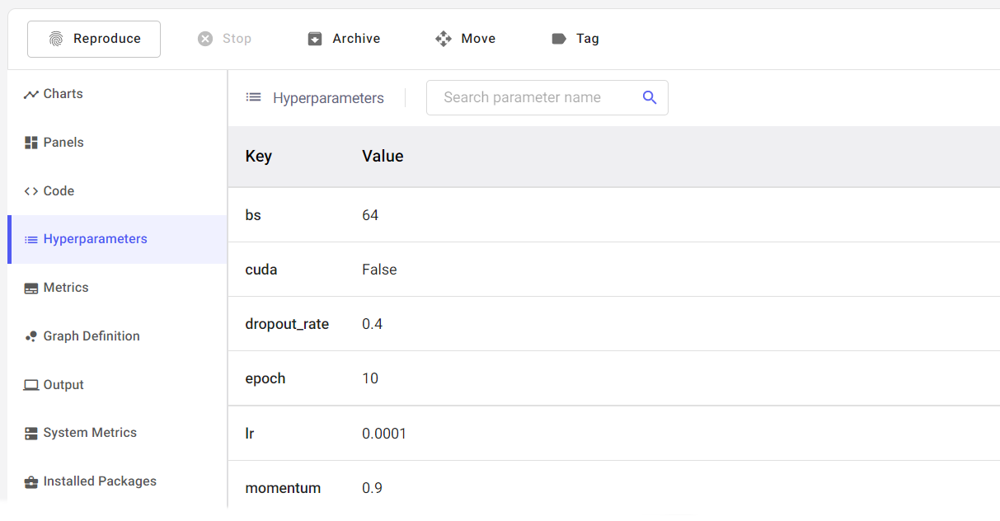
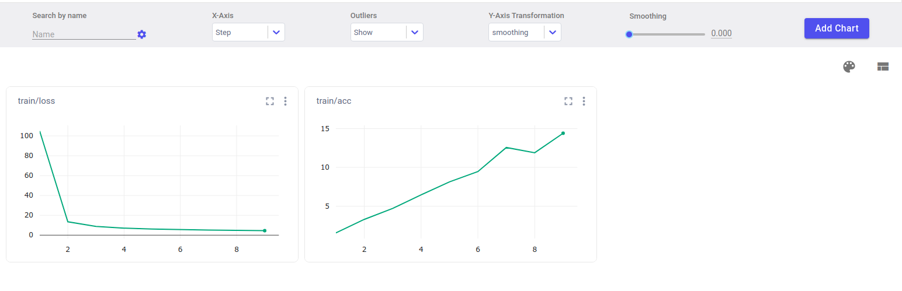
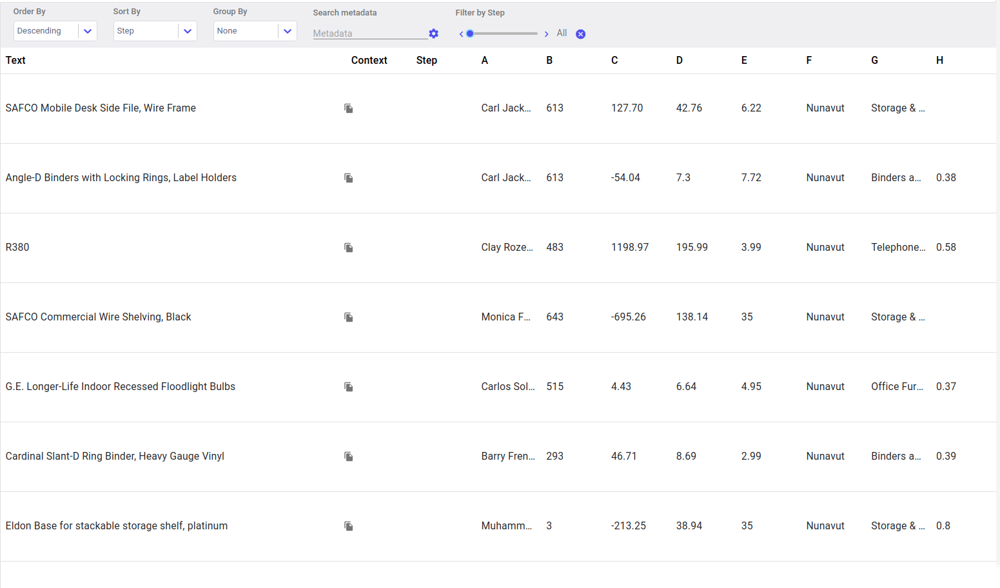

.. _exp_tracking:

==================================
Logging your experiment with UETAI
==================================

It might feel strange at first, but everything in **uetai** is exactly the same
as there is in your favorite tracking experiment framework.

In this tutorial, we will show you how to log your experiment with **uetai** 
using ``CometLogger``, with other dashboard you can use exactly the same syntax.

.. tip:: 

    With *Comet ML*, you can go to https://www.comet.ml/site/ to see your logged
    experiment.

Initialize experiment
=====================

Initialize your experiment with ``uetai.logger``

.. code-block:: python

    from uetai.logger import CometLogger

    logger = CometLogger(project_name='my-project', api_key='my-api-key')

.. note:: 

    If you don't pass API and your environment variable doesn't include any of 
    them, it (the logger) will ask for your API key.

Logging parameters
==================

Every experiment usually come up with a set of parameters. Logging them using
``log_parameters``, passing value should be a ``Dict[str, Any]`` or a 
``Namespace``:

.. code-block:: python

    # log Dict
    logger.log_parameters(
        {
            'bs': 64,
            'cuda': False,
            'dropout_rate': 0.4,
            'epoch': 10,
            'lr': 0.0001,
            'momentum': 0.9,
        }
    )

    # or Namespace
    logger.log_parameters(args_parser)

The hyperparameters will be logged after the run is finished. 
Find the it in the **hyperparameters** tabs.

Logging with ``log()``
=======================

We provided the same API syntax for all dashboard that we supported. These
API is built based on original's API and has been carefully validate input. 

Logging metrics
---------------

Logging metric wherever needed by ``log()``. Metrics are in form of pair of 
``key, val`` which value is a ``float``.

.. code-block:: python

    # train loop
    for epoch in range(epochs):
        # ...

        logger.log({
            'train/loss': loss, # float
            'train/acc': acc,
        }, step=epoch)

Logging image
-------------

``log()`` receives a image type object, which can be ``PIL.Image``, a 
``torch.Tensor``, a ``numpy.ndarray`` or path to existed image. 

.. important::
    Dimension of the image in ``Tensor`` and ``ndarray`` are reversed.

    ``Tensor`` input should be (C, H, W) and ``ndarray`` is (H, W, C).

.. tabs::

    .. group-tab:: Log image by path

        .. code-block:: python

            logger.log({'image path': "path/to/image.png"})

    .. group-tab:: Log Tensor/ndarray

        .. code-block:: python

            # Tensor image shape (C, H, W)
            rand_ts = torch.randn(1, 16, 16) * 255 
            logger.log({'tensor rand image': rand_ts}, step=epoch)

            # ndarray image shape (H, W, C)
            rand_np = np.random.rand(16, 16, 1) * 255
            logger.log({'numpy rand image': rand_np})

        
    .. group-tab:: Log PIL.Image

        .. code-block:: python

            from PIL import Image

            img = Image.open("path/to/image.png")
            logger.log({'PIL image': img}, step=epoch)

.. image:: ../_static/images/log_image.png
    :alt: log image

Logging text
------------

A ``text`` can be logged alone or with its metadata in form of 
``Dict[str, dict]`` or ``str`` where key is the text content and value 
is a its metedata.

.. code-block:: python

    logger.log('hello world')

    metadata = {
        'topic': 'random',
        'date': '2020-01-01',
        'author': 'me',
    }
    logger.log('hello world #2', metadata)

